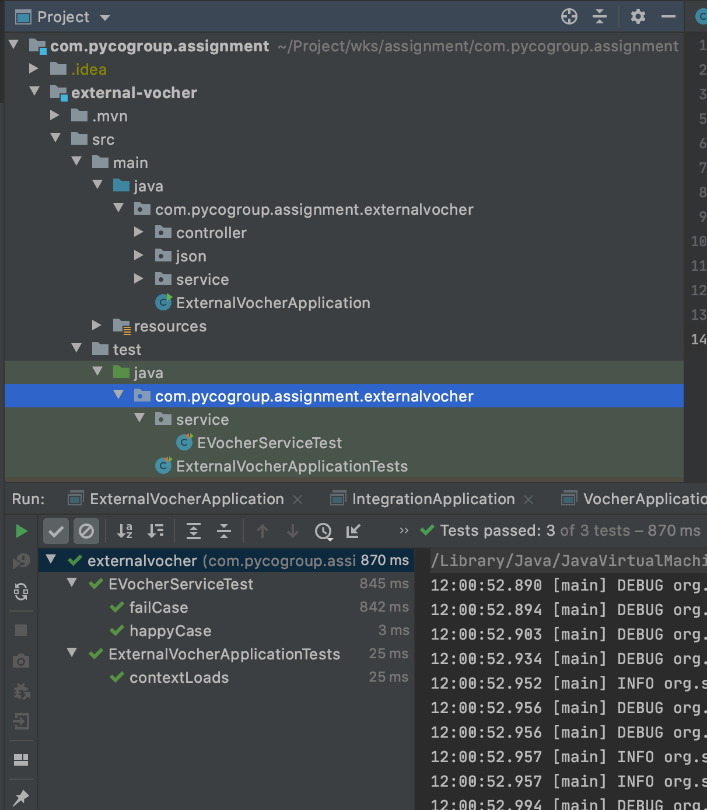
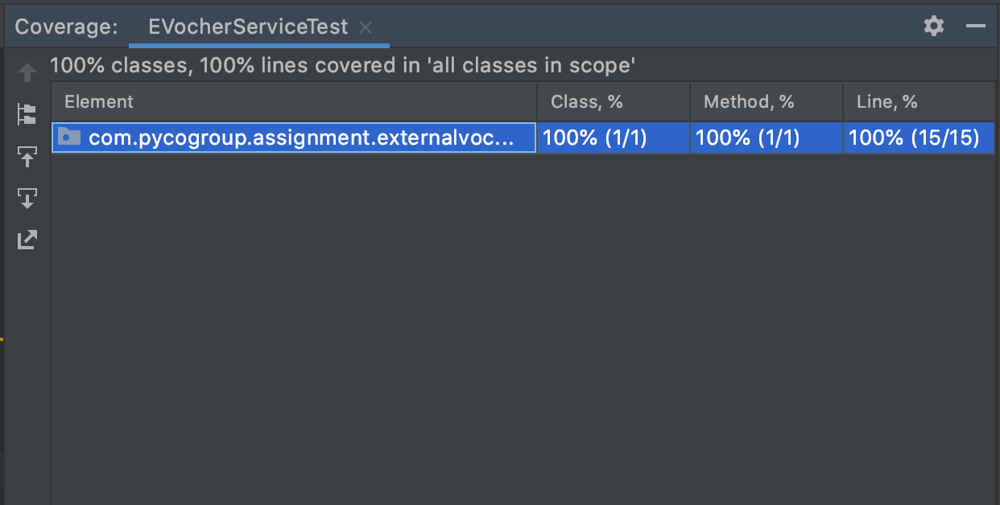
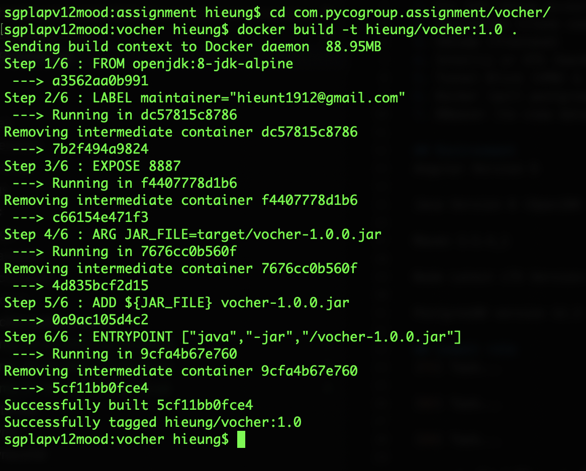
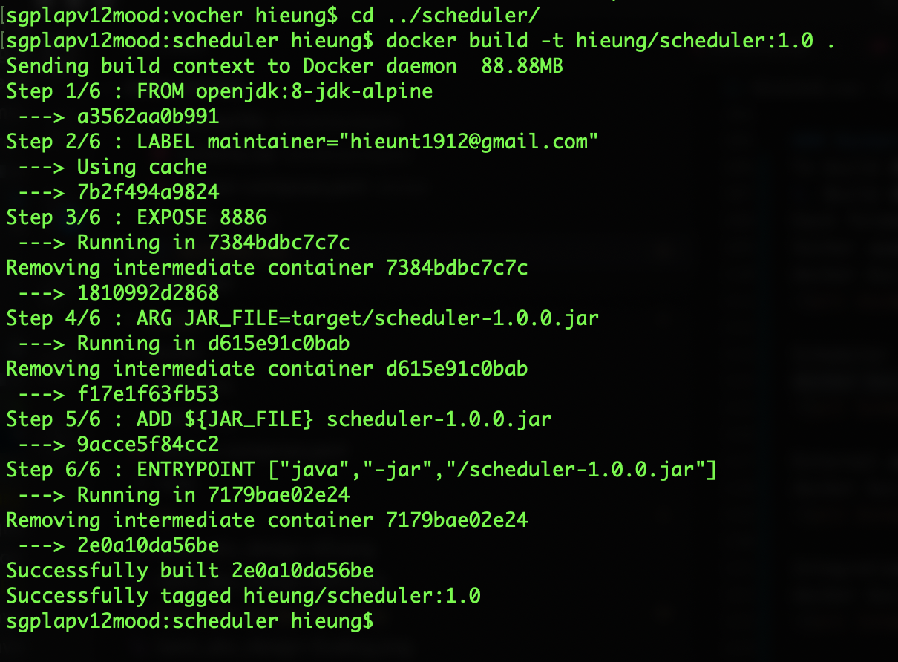
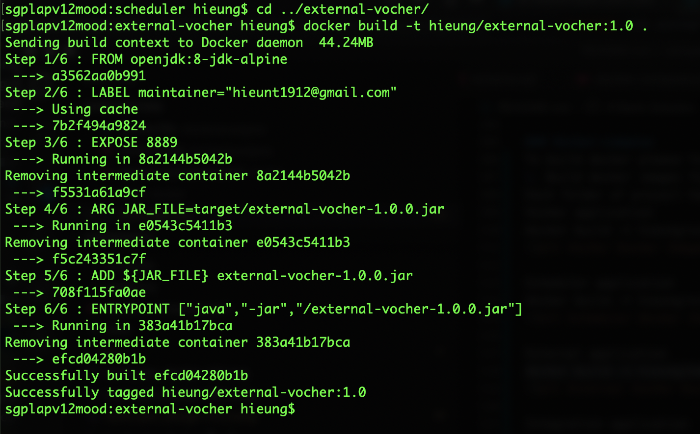
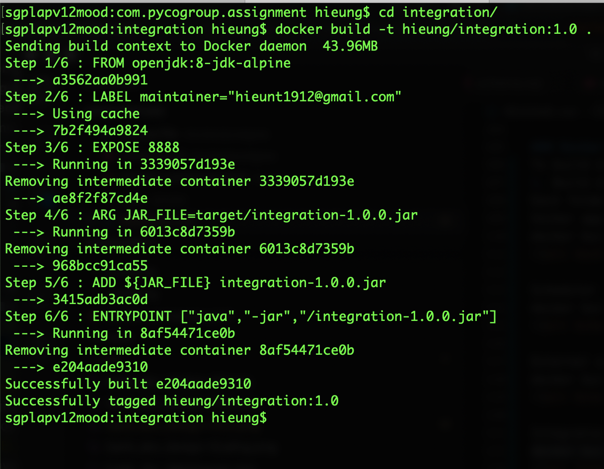
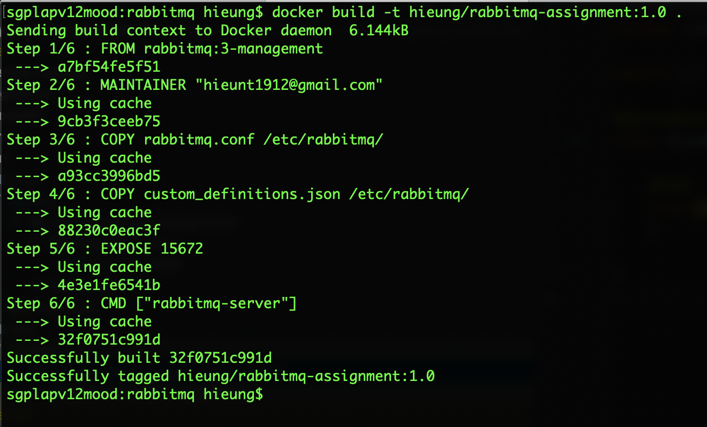
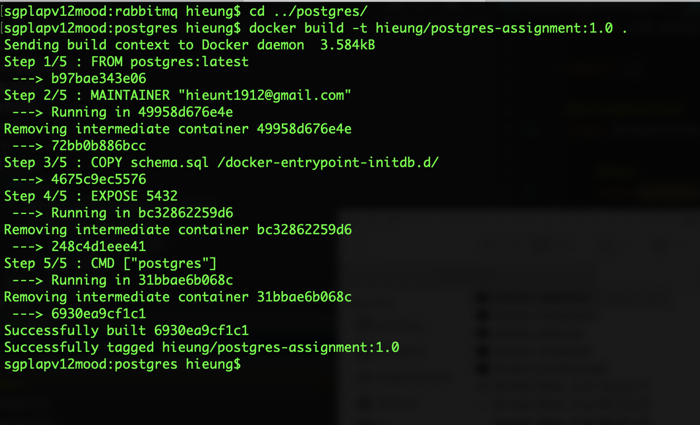
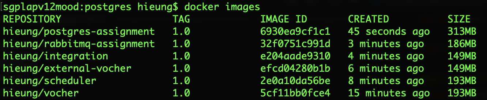
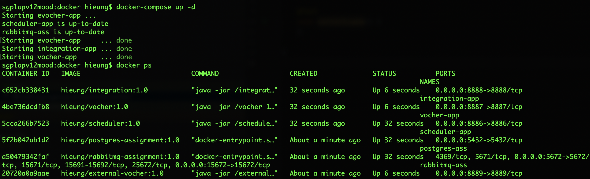

# Bank Solution

## Assumption
1. Assume that the payment has been done before the website call to the services to get the voucher code.
2. The proposal will mention about the ability scaling of this system. However,I skip it in the implementation. 
3. The authorization will be skipped & the  authentication will use in basic security.
4. Testing of this system will use by manual test.
5. The SMS system will be update as soon as the success message of batchjob.

## Description Solution

Following the assignment, proposal should have more than 3 components to interaction. 

The proposal will use the serverless technology of springboot to build RESTful application to transfer messages between differ component. Approaching with Springboot will take in many advantages. Springboot application could be run as standalone application that could be run on-premise or cloud environment.

Springboot scaling application is more easier because spring framework already support it. We could deploy an api gateway application (on-premise) or use api gateway of AWS to receive all messages and transfer for all scaled-app. And the proposal use the horizontal scaling approach.

The proposal system also have ability to take advance of failover. When we drop connection or some exception behaviour of third party vocher api. The proposal have batchjob (configurable by time) to scan in current systems and resubmit to third party api until the message is successful. When all system will down, it have the batchjob help re-run the crashing messages.

In this design, i choose use rabbitmq to do message queue to have advantages loose-coupling and easy to scale. Ofcourse, rabbitmq have some disadvantages that could be limit messages per second, when we approach will big problem we could change it to Kafka to have better performance.

## Technology
1. Springboot
2. Spring Data JPA
3. Spring Rest
4. Spring Security
5. Java 8
6. H2 Database
7. Docker
8. RabbitMQ

## Design & Material

### High Level Design

Description: 
In High Level Design Diagram, we have some components:

1. Scheduler application
 Scheduler application will help to resend failure messages to vocher api through gateway API. It will scan failed record with time configurable (In project, the configure time is 3 seconds).
2. Vocher application
Vocher application will interaction with database and queue messaging. It used to storing data vocher and pushing vocher request to queue and receive vocher respose(failed or passed) through evocher queue, and update to database.
3. Evocher application
Evocher application will be treat as third party services that supplies evocher to our vocher system. Evocher will respond pass or fail record. If Evocher return pass, the evocher will be return. If Evocher return fail, the evocher will empty or have exception. The percentage rate is 60% for pass, 40% for fail.
4. Integration application
Integration receive request vocher from vocher queue, and send to Evocher application to get evocher. Both case (pass or fail) will be put it evocher queue to have update information.
5. Queue System
This assgiment have configured 2 queue: vocher queue, evocher queue. Vocher queue used to request evocher. Evocher queue used to return response Evocher used to update information.
6. Postgres database
This is main database of project.
7. API Gateway.
The first API  gateway used to receive message and transfer round-robin to vocher api. It will do scaling vocher application.
The second API gateway use to receive message and transfer round-robin to integration api. It will do scaling integration application.

Scaling will be apply by clone app vocher application and integration application, the gateway api will configurable to point to some new applications (vocher, integration). This assignment could be applied fully horizontal scaling.
This design easy to adapt with current cloud environment as AWS or K8S. To deploy on cloud we need do some configuration, based on Cloud Provider.

### Activity Diagram

### Sequence Diagram

### Sequence Diagram - Failover

### Entity Relationship Diagram

## Guide
This assignment will be configure cronjob in 3s to support failover feature. To check status of vocher creation. We should come to table history and view value in that. The interactions of records will be stored. For example:

I build an External Vocher API to generate evocher that is 3rd party system to call API and get Vocher. Error Rate in external vocher is 40% for failure and 60% for success.

API Port
1. external-vocher - 8889
2. integration - 8888
3. vocher - 8887
4. scheduler - 8886

Service Port
5. rabbitmq - 15672
6. postgres - 5432

Import project com.pycogroup.assignment to intellij and run. Remember setup queue and database (look at some images in troubleshooting)

### How to run from source code
Checkout source code in github
Create database & Run db_script/schema.sql
Configure rabbitmq (add exchange & queue & routing)
Start 4 Application (vocher, evocher, integration, scheduler)
Check by Postman

Run by docker compose

### Execute CURL
I already export postman collection json in the same folder with naming bank_abc.postman_collection.json

CURL

1. Vocher API (Main):
> curl -X POST 'http://localhost:8887/vocher?simcard=0989123456'

2. 3rd system Evocher API (generate evocher code - System will do automatically):
> curl -X POST 'http://localhost:8889/evocher?simcard=0989123456'

This using for checking purpose.

### Testing

#### Unit Test
There are 2 test cases for evocher. Check in source code.

Unit Test

Coverage Code

#### QA Test
Get vocher by the first API(Main) of CURL to get vocher.

1. Case 1: 
Turn on 4 components: vocher, integration, evocher, scheduler
Call Main API, to get evocher, check in DB table vocher, history. The status will be passed or failed because i configure error rate in (60% pass - 40% fail).
If pass we could check evocher record in table vocher. And fail evocher don't have and the status will be mark fail.

2. Case 2: 
Turn on integration, vocher, scheduler
Turn off evocher.
Call Main API, to get evocher, check in DB table vocher, history. The status will be failed.
Every 3 seconds, it will get automatically and send it again. View result in history table. It has recorded.

3. Case 3:
Turn on 4 components: vocher, integration, evocher, scheduler
Create some record fail in table vocher. Turn off 4 components and restart it.
The system will be get all failed record and resend to recover some fail case and make it pass. 

### Docker 
To build docker please follow below:

1. Build docker images for each application.
Each folder of project have Dockerfile in root. Should build it by command below:
Vocher application
> docker build -t hieung/vocher:1.0 .

Scheduler application
> docker build -t hieung/scheduler:1.0 .

External application
> docker build -t hieung/external-vocher:1.0 .

Integration application
> docker build -t hieung/integration:1.0 .

2. Build rabbitmq images.
Go to folder /docker/rabbitmq. And run command below:
> docker build -t hieung/rabbitmq-assignment:1.0 .

> docker run -d --hostname $CONTAINER --name $CONTAINER -p 15672:15672 -e RABBITMQ_ERLANG_COOKIE='example secret' hieung/rabbitmq-assignment:1.0

Note: The configuration rabbitmq (exchange, routing_key, queue) of the assignemnt is included.

3. Build postgresdb images.
Go to folder docker/postgres. And run command below:
> docker build -t hieung/postgres-assignment:1.0 .

docker run --name postgres-assignment -p 5432:5432 -e POSTGRES_PASSWORD=mysecretpassword -d hieung/postgres-assignment:1.0
Note: The database of the assignemnt is included.

4. After building all images.
Please check docker images by command: 
> docker images

Run by docker-compose.
Go to foler docker and open docker-compose.yml file to view detail. Run by command below:
> docker-compose up -d

### Troubleshooting
Structure of Assignment Project

Config rabbitmq in http://localhost:15672/#/exchanges (guest/guest). This assignment also have export rabbitmq configuration in folder /docker/rabbitmq.

Create database assignment

### Disadvantages and Enhances

So The limit time could not help to have more component to design as using some Spring Cloud technique or using some external framework as terraform, ...

This design only focus to solve the issues and try to have fully adapt with requirement.

If I have more time, I will come up with tracing log by setting it using Sleuth, Zippkin Server or ELK service.

Although I also use Spring actuator to monitor application but it is not enough. In future, we could monitor application using New Relic or DataDog on cloud environment.

Although, This assignment have build docker-compose. In future, This assignment needs some automation script to apply fully CI/CD pipeline.
The rabbitmq have some limitation about the workload performance, this assignment should use kafka to have some advantage of kafka to have full scaling features.

Applying fully microservice for scaling(based on Spring Cloud or Spring Netflix OSS) in future.