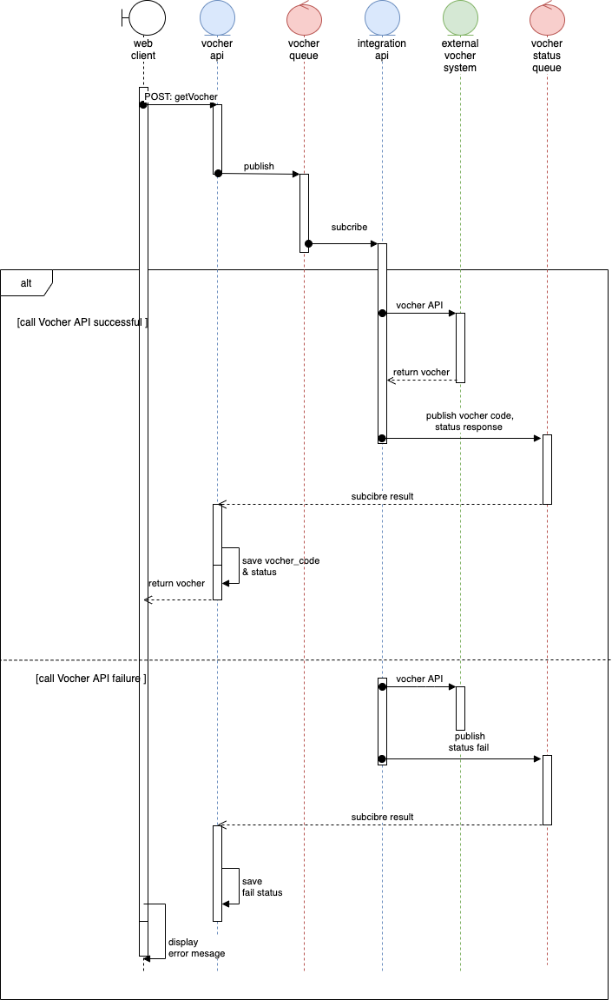
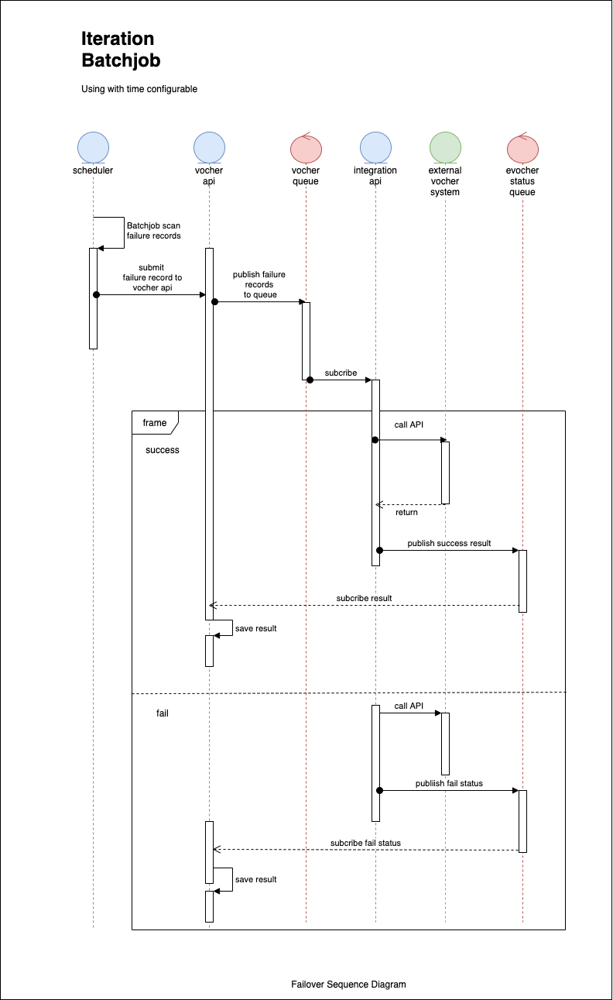

# Bank Solution

## Assumption
1. Assume that the payment has been done before the website call to the services to get the voucher code.
2. The proposal will mention about the ability scaling of this system. However,I skip it in the implementation.
3. The authorization will be skipped & the  authentication will use in basic security.
4. Testing of this system will use by manual test.
5. The SMS system will be update as soon as the success message of batchjob.

## Description Solution

Following the assignment, proposal should have more than 2 components to interaction. 

The proposal will use the serverless technology of springboot to build RESTful application to transfer messages between differ component. Approaching with Springboot will take in many advantages. Springboot application could be run as standalone application that could be run on-premise or cloud environment.

Springboot scaling application is more easier because spring framework already support it. We could deploy an api gateway application (on-premise) or use api gateway of AWS to receive all messages and transfer for all scaled-app. And the proposal use the horizontal scaling approach.

The proposal system also have ability to take advance of failover. When we drop connection or some exception behaviour of third party vocher api. The proposal have batchjob (configurable by time) to scan in current systems and resubmit to third party api until the message is successful. When all system will down, it have the batchjob help re-run the crashing messages.

In this design, i choose use rabbitmq to do message queue to have advantages loose-coupling and easy to scale. Ofcourse, rabbitmq have some disadvantages that could be limit messages per second, when we approach will big problem we could change it to Kafka to have better performance.

## Technology
1. Springboot
2. Spring Data JPA
3. Spring Rest
4. Spring Security
5. Java 8
6. H2 Database
7. Docker
8. RabbitMQ

## Design & Material

### High Level Design

### Activity Diagram

### Sequence Diagram

### Sequence Diagram - Failover

### Entity Relationship Diagram

## Guide
This assignment will be configure cronjob in 10s to support failover feature. To check status of vocher creation. We should come to table history and view value in that. For example:

I build an External Vocher API to generate evocher that is 3rd party system to call API and get Vocher. Error Rate in external vocher is 80% for failure and 20% for success.

API Port
1. external-vocher - 8889
2. integration - 8888
3. vocher - 8887

Import project com.pycogroup.assignment to intellij and run. Remember setup queue and database (look at some images in troubleshooting)

### How to run from source code
Checkout source code in github
Create database & Run db_script/schema.sql
Configure rabbitmq (add exchange & queue & routing)
Start 3 Application (vocher, evocher, integration)
Chek by Postman

Run docker

### Execute CURL
I already export postman collection json in the same folder with naming bank_abc.postman_collection.json

CURL
1. Vocher API (Main):
curl -X POST 'http://localhost:8887/vocher?simcard=0989123456'

2. 3rd system Evocher API (generate evocher code - System will do automatically):
curl -X POST 'http://localhost:8889/evocher?simcard=0989123456'
This using for checking purpose.

### Manual Test
I get vocher by the first API(Main) of CURL to get vocher.
1. Case 1: 
Turn on 3 component: vocher, integration, evocher
Call Main API, to get evocher, check in DB table vocher, history. The status will be passed or failed because i configure error rate in (20% pass - 80% fail).
If pass we could check evocher record in table vocher. And fail evocher don't have and the status will be mark fail.

2. Case 2: 
Turn on integration, vocher
Turn off evocher.
Call Main API, to get evocher, check in DB table vocher, history. The status will be failed.
Every 10 seconds, it will get automatically and send it again. View result in history table. It has recorded.

3. Case 3:
Turn on 3 component: vocher, integration, evocher
Create some record fail in table vocher. Turn off 3 components and restart it.
The system will be get all failed record and resend to recover some fail case and make it pass. 

### Docker-compose
N/A

### Troubleshooting
Structure of Assignment Project

Config rabbitmq in http://localhost:15672/#/exchanges (guest/guest)

Create database assignment
